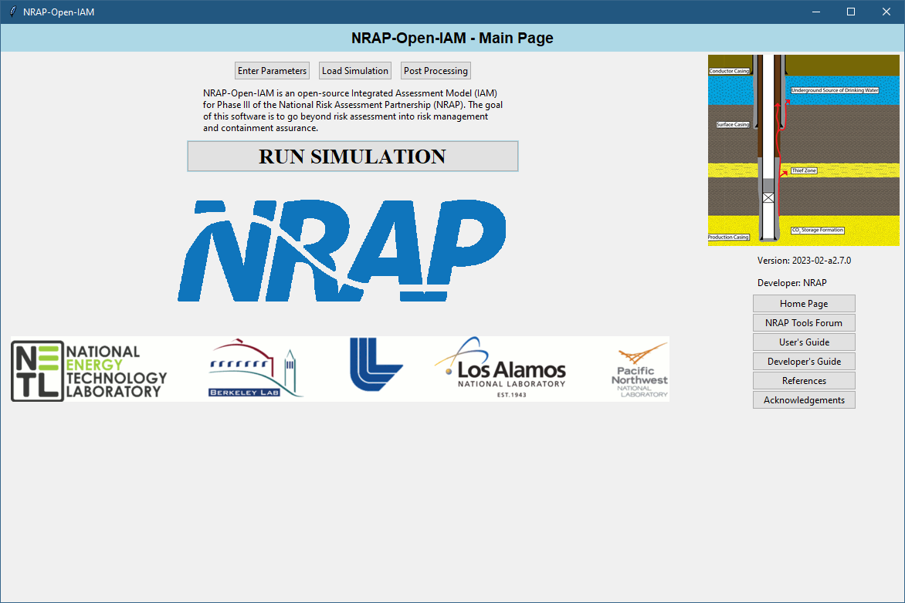
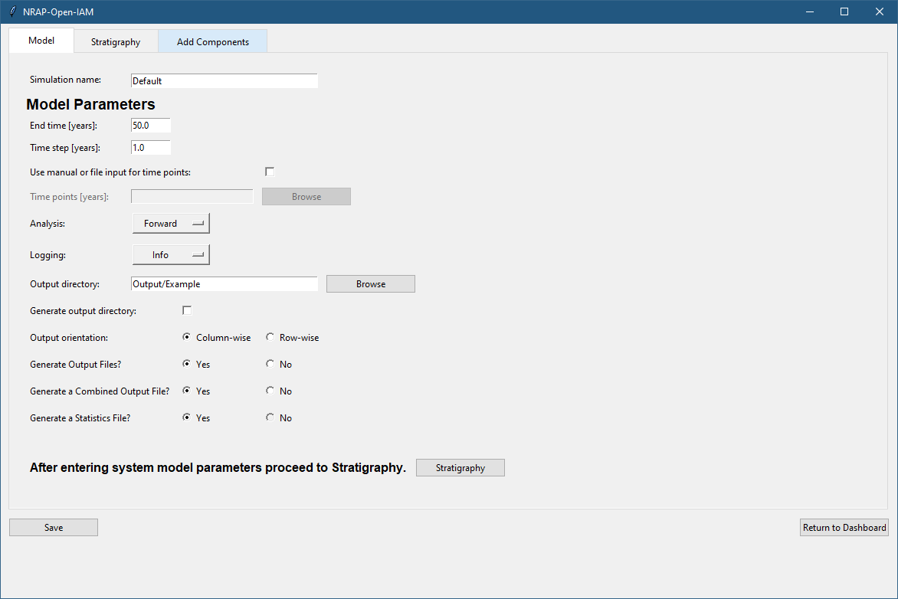
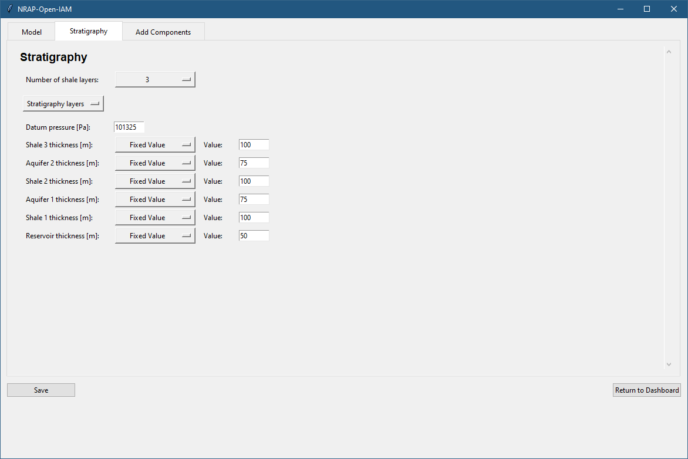
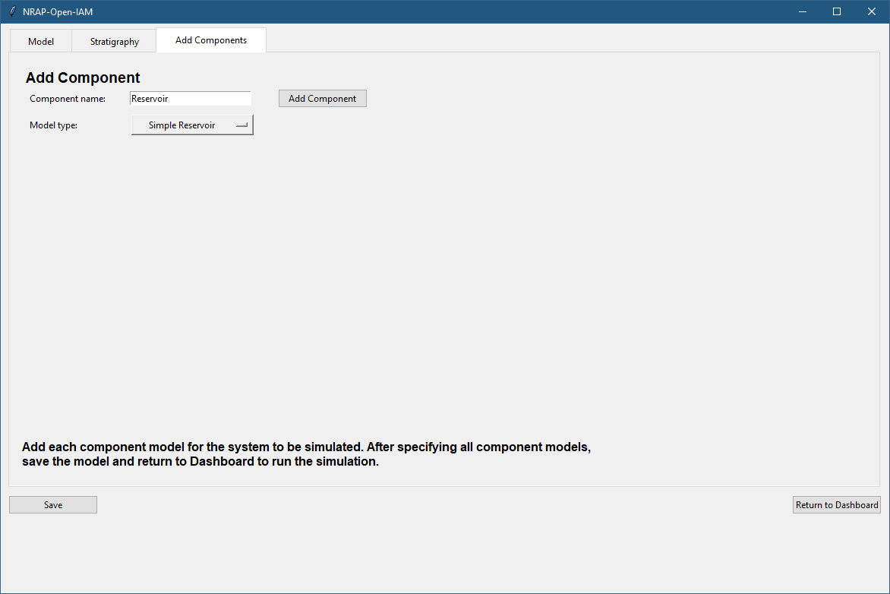
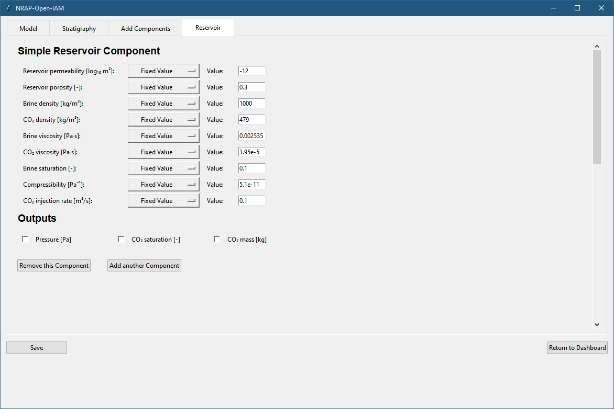
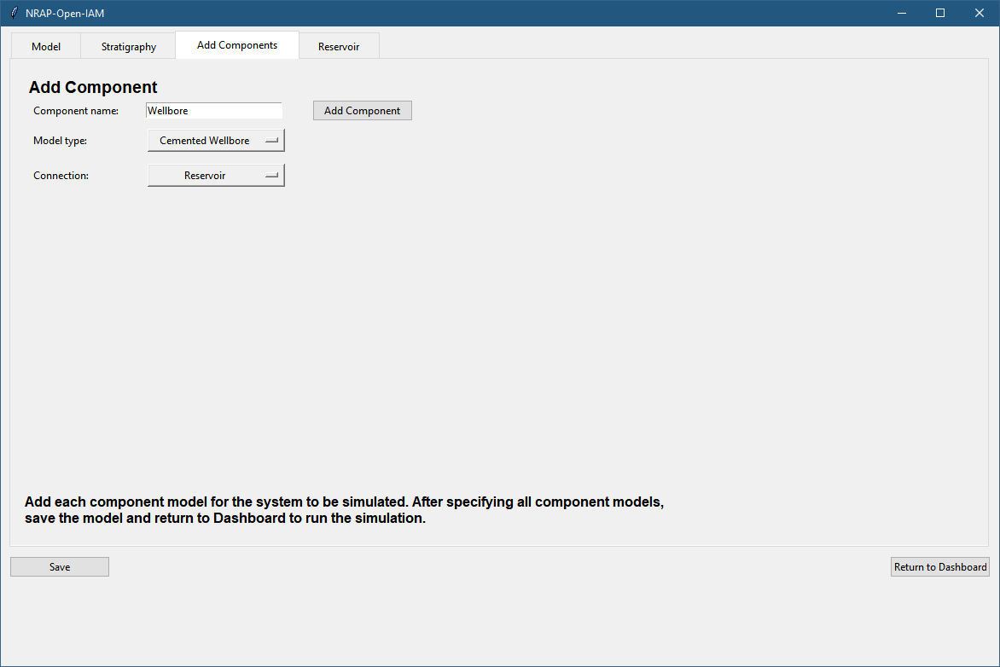
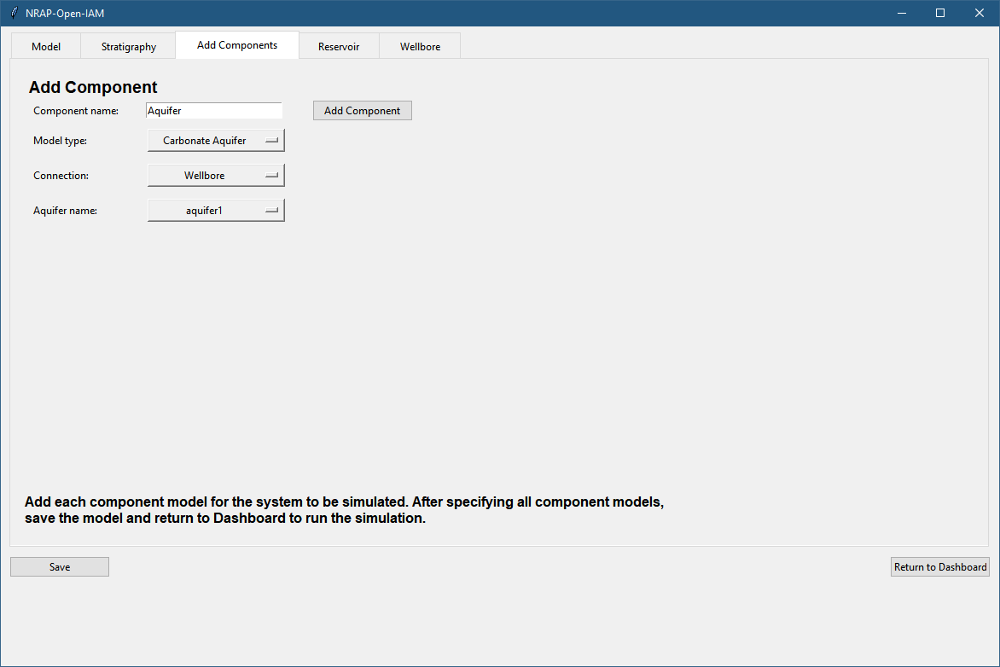

.. _gui_operation:

GUI Operation
=============

When the graphical user interface (GUI) is first opened, a disclaimer screen
will be shown followed by the main interface.

   Main NRAP-Open-IAM Interface

To begin building a model, click on the **Enter Parameters** button.
The process of building a model consists of entering basic model parameters,
defining the stratigraphy of the site, and then adding each component to be
included in the system model. Therefore, the first tab that a user would see
after clicking the **Enter Parameters** button is the model parameters view.

   Model Parameters View

Start by defining a ``Simulation name`` for the model: the name also will be used as the
name of the file containing details of the NRAP-Open-IAM simulation. Time should be entered in years.
The ``End time`` is the total number of years that will be considered in simulation.
The ``Time step`` entry specifies the uniform time step taken during the simulation
(typically 1 year time steps are used). NRAP-Open-IAM can run simulations with three
different analysis types: ``Forward``, ``LHS``, and ``Parstudy``. The ``Forward`` analysis
type runs a single deterministic scenario, where parameter values are constant and the results
will be the same each time the simulation is run. ``LHS`` (abbreviation for Latin Hypercube Sampling)
is the analysis type used for stochastic simulations with random variations in parameter values. 
The ``Parstudy`` analysis type (short for parameter study analysis) evaluates a user-defined number of
random values for each stochastic parameter. See section :ref:`conceptual_model_overview` for
more details regarding these analysis types.

NRAP-Open-IAM creates a log file for each simulation: the level of information
being logged can be set by the ``Logging`` entry. In general, the
default level of ``Info`` would contain the most useful messages. A ``Debug``
(debugging) level of ``Logging`` will contain more information about component
model connections, setup and calls, but will produce very large files and should be
avoided for large simulations. ``Warn`` (warning) and ``Error`` levels can be used
if log file sizes become an issue; only more important messages will be logged.

NRAP-Open-IAM will save all the simulation results to the specified ``Output directory``.
In the text field corresponding to ``Output directory``, the user needs to enter
a path to the folder where the output will be saved. In the case the entered path
does not exist, the empty directory will be created if the ``Generate output directory``
box is checked. Additionally, if the provided path is not absolute, it is assumed
that it starts in the NRAP-Open-IAM root folder. A ``{datetime}`` stamp can be added
to the folder name so that each run of a particular simulation will be saved separately,
otherwise results from a previous run will be overwritten by subsequent runs until the
output folder is changed. After setting up the model parameters, proceed to the Stratigraphy tab.

   Stratigraphy View

In the Statigraphy tab, model parameters related to the stratigraphy of the geologic carbon
storage site are defined. All coordinate systems are assumed to have units of meters and
are defined by the reservoir component used. Model parameters for the stratigraphy
and appropriate components are defined by either assigning a fixed value
or random distribution to vary over. For the ``LHS`` analysis type, parameters defined
with a distribution will be sampled from that distribution. For the ``Forward`` analysis
type, all parameters should be specified with a fixed value. See the :ref:`stratigraphy_component`
section of this document for a list of all available parameters and their definitions.
Although there are other types of stratigraphy components in NRAP-Open-IAM (e.g., 
``LookupTableStratigraphy``), these other component types are not currently available in
the GUI.

Adding Component Models
-----------------------

NRAP-Open-IAM is designed so that only the components of interest need to be included
in the system model. Generally, a simulation will be built upwards starting from the deepest
component (e.g., first reservoir, then wellbore, then aquifer, then atmosphere).
To add a component, first give it a name (each component must have a unique name).
Next, select the type of component model to be used. When adding subsequent components,
a connection to existing components can be specified.

   Adding a Component Model

Each component model has component-specific input parameters and outputs.
Parameters can be specified to be sampled from different distributions.
If a parameter value is left unchanged from its initial ``Fixed Value``
setting, the default value shown will be used. When running a ``Forward``
model, parameters should only be specified as fixed values. When running
a ``Parstudy`` simulation, the parameters meant to vary should be specified
as having a uniform distribution and minimum and maximum values. For ``LHS``
simulations, any distribution can be specified. Parameter and output definitions
can be found in the chapter :ref:`components_description`.

   Setup of Reservoir Component

When using a component that generally needs input from another component but that
component is not to be part of the model (i.e., using a wellbore model without a reservoir model),
dynamic parameters can be used for component model input. For dynamic parameters, a value
must be specified for each time step in the simulation. Values can be entered
manually (separated by a comma) or by providing the path to a file containing the data.
Some components require specification of which layer in the stratigraphy they
represent (such as an aquifer model).

   Adding Second Component

   Adding a Component Model with Connection and a Stratigraphy Selection

After one component has been added to the system model, more components can
can be added. When all required components have been included, save the model and
return to the dashboard. The system model can then be run using
the **RUN SIMULATION** button on the main dashboard.

GUI Setup Examples
------------------

In the folder *examples*, there is a subfolder called *GUI_Files* with example simulation
files that can be loaded into the GUI and run by NRAP-Open-IAM. To run one
of the provided examples select **Load Simulation** on the main dashboard of the GUI.
In the file browser that appears, navigate to the *GUI_Files* subfolder of the
*examples* folder and select the first example file *01_Forward_AR_CW.OpenIAM*.
This example runs a simple forward model with an ``AnalyticalReservoir`` component
providing inputs to a ``CementedWellbore`` component.

When the file is loaded into the GUI, the parameters of the simulation
can be inspected. After the simulation is complete, the user can proceed to the
post-processing step (by clicking **Post Processing** on the main dashboard of the GUI)
to visualize and, for some scenarios, analyze the obtained results. The Post Processing
tab has a folder selection button with which the user can select the folder
containing simulation results. Note that the selection of the folder (and loading of results)
might fail if the simulation did not finish successfully. In this case it is recommended
to check file *IAM_log.log* within the output folder containing useful (debug, info,
warning or error) messages produced during the simulation. A text editor like Notepad can
be used to open the *IAM_log.log* file. The file name of each GUI example is
made to show the components and analyses demonstrated by the example (e.g., ``AR`` for
``AnalyticalReservoir`` and ``OW`` for ``OpenWellbore``).

The second example file *02_LHS_AR_MSW.OpenIAM* is a stochastic simulation for a
system model containing ``AnalyticalReservoir`` and ``MultisegmentedWellbore``
components. The example illustrates the use of the Latin Hypercube Sampling analysis type,
with parameter values varying across 30 different realizations.

The third example file *03_LHS_LUT_MSW.OpenIAM* illustrates the use of
``LookupTableReservoir`` and ``MultisegmentedWellbore`` components. The data
set used for the ``LookupTableReservoir`` component is based on a simulation made
for the Kimberlina oil field (:cite:`DAA2018`).

The fourth example file *04_LHS_DP_MSW.OpenIAM* illustrates Latin Hypercube
Sampling analysis type applied to a ``MultisegmentedWellbore`` component. The pressure
and |CO2| saturation required as inputs of the component are provided in the
form of arrays. This form of input arguments is called dynamic parameters (``DP``;
i.e., component inputs that change over time).

The fifth example file *05_LHS_AR_OW_CA.OpenIAM* illustrates the application of
three component models: ``AnalyticalReservoir``, ``OpenWellbore`` and ``CarbonateAquifer``
components. The example uses the ``LHS`` analysis type to estimate the reservoir's
response to |CO2| injection, the leakage of fluids through a wellbore, and the impact
of this leakage on an aquifer overlying the storage reservoir.
